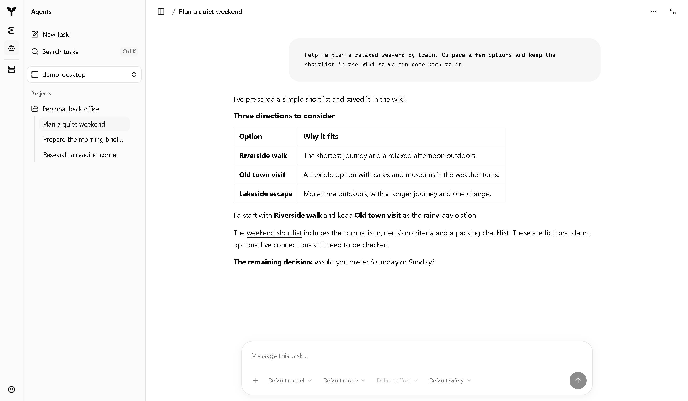
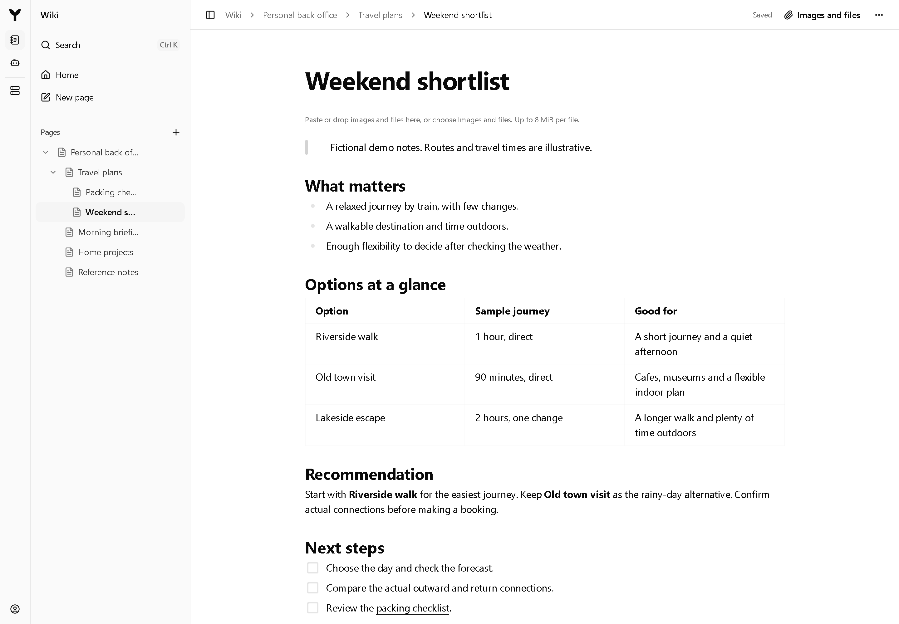
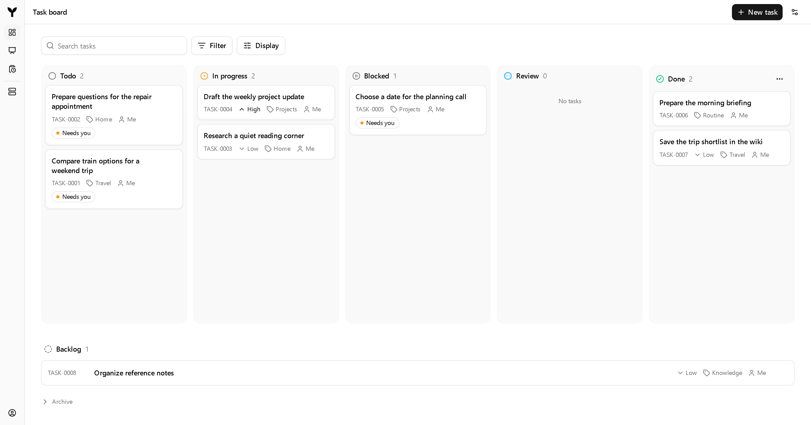
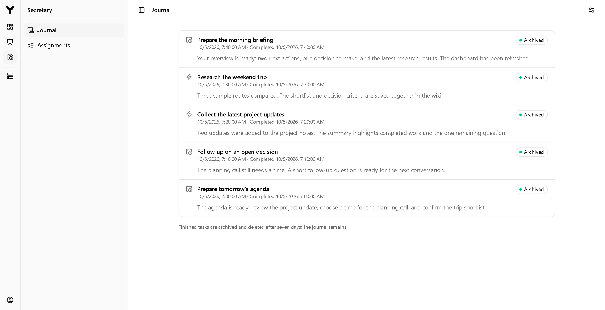
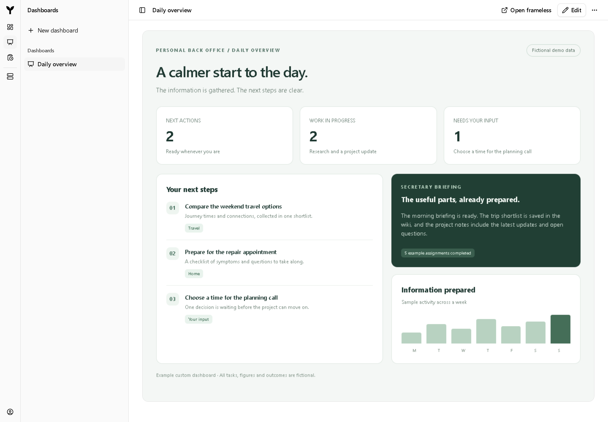

# Ivy 

> [!WARNING]
> **Ivy is alpha software.** Expect bugs, incomplete features and breaking changes.
>
> **An Ivy access token means full access.** Ivy is designed to give its holder
> control over the installation: reading and changing data, invoking services and
> acting through connected accounts and hosts. Give a token only to people and
> agents you trust with those capabilities, and understand what you are connecting.
> **Ivy is not a security-centric application.** It is a personal back office built
> around broad, trusted access; do not rely on it to isolate untrusted users or agents.

**Your personal back office. Send it a message. Give it a call. Let it handle the work.**

Everyday work is scattered across conversations, websites, documents and reminders.
Finding the relevant information, turning it into something useful and following
through is often more work than the decision itself. Ivy brings that work together
in a self-hosted personal back office that you can talk to and delegate to.

Chat with Ivy over **WhatsApp**, or speak to it through **real incoming and outgoing
phone calls**. It can act as your secretary: gather information, research a question,
prepare a summary, keep track of open work and follow up when something needs your
attention. Agents use your connected tools and accounts to carry out tasks; the web
apps let you inspect the work, review results and keep the context for next time.

- **Talk naturally.** Ask for help, send material and receive replies in WhatsApp.
  PhoneBridge connects SIP phone calls to a voice agent, so you can call Ivy or have
  it call a configured recipient.
- **Have a secretary on duty.** Schedule a morning briefing, react to incoming
  information, surface relevant changes and ask follow-up questions. Configure when
  Ivy should notify you and when an urgent matter warrants a call.
- **Turn information into something useful.** Collect data, research and compare
  options, write summaries, maintain a wiki and create dashboards for a browser or
  a display.
- **Get work done and keep track of it.** Delegate tasks, let agents use the tools
  available on your hosts, and track progress, discussion and results on a shared
  task board.

For example: ask Ivy to compare options for a trip, keep the shortlist in your wiki
and remind you when a decision is due. Or have it collect updates each morning,
prepare a briefing and show the important changes on a dashboard. The services,
accounts and agent tools you configure determine what your installation can do.
WhatsApp needs a linked account; phone calls need SIP access and the supported
desktop audio and voice setup.

## Use the agent you prefer

Ivy makes all of these back-office capabilities available through **MCP**. Any
MCP-capable agent can use them: **ChatGPT in the cloud, Claude, Codex, or agents
powered by open-weight models**. Connect your client to Hive and authenticate;
the agent can then use the installed services, shared knowledge and work regardless
of its model provider. For an open-weight model, the surrounding agent runtime
provides the MCP connection and tool execution.

For work executed inside your installation, **AgentManager can use either Codex or
Claude as its backend**. **The Codex App Server Protocol is a first-class citizen**
and the default native integration: Ivy preserves its supported methods, events
and task lifecycle. Claude is available through the optional
[Claude adapter](specs/CLAUDE-ADAPTER.md), using the Claude Agent SDK and the same
AgentManager service interface for the operations the adapter supports.

MCP access and execution backends are separate choices. Your preferred MCP agent
can request an installed capability even when that service uses another backend.
Service prerequisites still apply: PhoneBridge, for example, currently uses Codex
Desktop Voice and its supported audio setup. The [MCP interface](specs/IVYHIVE-SPEC.md)
separates everyday tools (`ivy`) from development and maintenance tools (`ivy_dev`);
backend-specific operations follow the capabilities advertised by that instance.

## A look inside

These are screenshots of Ivy's actual web apps in an isolated local demo. All
conversations, wiki pages, tasks, schedules and results are fictional. Agent
responses are simulated for the demo. The dashboard is an example of a custom HTML
dashboard you or an agent can create; it is not a preconfigured home screen.

**Agents you can work with.** AgentUI gives you a web workspace for the conversations,
projects and tasks managed by AgentManager.

**Knowledge you can keep and edit.** WikiUI brings research, context and decisions
together in linked pages with revision history.

**Work you can follow.** Tasks stay visible from the next action through completion.

**A secretary with a record of its work.** Scheduled and event-triggered assignments
leave a journal with their outcomes.

**Information at a glance.** A custom dashboard turns collected information into
an overview you can keep open in a browser or render for a display.

## How it fits together

Hive stores versioned knowledge and work, discovers services and routes tools and
events. Agents access it through MCP. Services run on the Windows or Linux host that
owns the required account, runtime or device: a small server can host Hive while a
desktop runs agents, browser integrations or phone audio. Install only the components
you need. Hive and service state live in your installation; connected AI providers
and integrations receive the data needed for their work under their own accounts.

| Entry point                                                                                  | Purpose                                                   |
| -------------------------------------------------------------------------------------------- | --------------------------------------------------------- |
| [Hive](services/hive)                                                                        | Objects, discovery, routing and the built-in Console      |
| [AgentManager](services/agent-manager) / [AgentUI](ui/agent-ui)                              | Codex and Claude backends, tasks and managed environments |
| [TaskBoard](services/task-board) / [TaskBoardUI](ui/task-board-ui)                           | Scheduled task work, comments and result review           |
| [WikiUI](ui/wiki-ui)                                                                         | Editable knowledge with attachments and revision history  |
| [ChatBridge](services/chat-bridge)                                                           | WhatsApp conversations, replies and service notifications |
| [PhoneBridge](services/phone-bridge/README.md)                                               | Real SIP phone calls connected to a voice agent           |
| [Secretary](services/secretary) / [SecretaryUI](ui/secretary-ui)                             | Scheduled assignments, inbox, notices and follow-up       |
| [Dashboards](specs/DASHBOARDS.md) / [DashboardsUI](ui/dashboards-ui)                         | Agent-authored HTML, live Hive data and PNG output        |
| [DataCollector](services/data-collector/README.md) / [DataCollectorUI](ui/data-collector-ui) | Isolated script tasks and versioned collection results    |
| [Host runtime](packages/host-runtime) / [CLI](packages/cli)                                  | Local supervision, component updates and recovery         |

## Installation

Start with Hive, HostExecutor and ServiceManager. Hive includes the web Console;
the other services and apps are optional. Use Node.js 24.18 or newer in the 24.x
line and the npm version pinned in [package.json](package.json). Expose remote
installations through an HTTPS reverse proxy.

Follow [First public installation](specs/DEPLOYMENT.md#first-public-installation)
to create the host configuration, generate credentials, prepare immutable
component packages and install them with the local CLI. This is an operator-led
installation: accounts, native executables, devices and DNS need local setup.

New host configurations inherit portable [service defaults](specs/DEPLOYMENT.md#service-defaults):
isolated AgentManager homes, platform-appropriate native connections, automatic
package/configuration reconciliation and service resource limits. Explicit settings
take precedence. Credentials and account identities are never shipped as defaults.
The default product language is English; localized deployments can select other
supported languages, with English as the fallback.

`npm run dev` is a development workspace and is not an installed release. A
prepared component candidate is the immutable artifact that the host runtime
installs or that a package publisher uploads to Hive.

## Private extensions

You can keep custom integrations, services and web apps in a separate private
repository. Ivy discovers them from their runtime registrations and advertised
interfaces; the public repository does not need to import or know their implementation.

1. Use the public [SDK](packages/sdk) and its [package workflow](packages/README.md).
   Pin an immutable SDK package commit. The
   [service example](docs/examples/services/automation-example) demonstrates tool,
   event and data-contract registration; the [UI example](docs/examples/ui-sample)
   demonstrates a standalone app using `@ivy/sdk` and `@ivy/ui`.
   In a separate checkout, replace the service example's relative SDK imports with
   `@ivy/sdk/node` and `@ivy/sdk/host`.
2. Give each component its own `deploy.json` following the
   [component contract](specs/schemas/component.schema.json). Build and prepare it
   from its own checkout, adapting the build commands and entrypoint to that project.
   Then publish the immutable package to your Hive's package
   catalog using the [deployment workflow](specs/DEPLOYMENT.md#first-public-installation).
3. Configure the service on its owning host, verify its registrations and relevant
   interactions, then enable it. Publish web apps through the same package catalog.
   Keep credentials, account data and runtime state outside source and release artifacts;
   declare sensitive service settings with `secretPaths` in the host configuration.

For script-based integrations, [DataCollector examples](docs/examples/data-collector)
show how to collect data without writing a new long-running service. Private
extensions are optional; a standard installation uses this repository alone.

## Development

Use the Node/npm versions and commands in [package.json](package.json), install with
`npm ci`, and follow [AGENTS.md](AGENTS.md) for focused checks. Build tooling lives in
[tools/build](tools/build); component preparation uses each component's `deploy.json`.
[Local host operations](specs/DEPLOYMENT.md#local-host-operations) cover deployment and recovery.

Format only selected handwritten JavaScript, TypeScript, Vue, JSON or Markdown files with
`npm run format:check -- <files>` and `npm run format:write -- <files>`. Check selected
JavaScript, TypeScript and Vue files with `npm run lint -- <files>`; linting never fixes files.
Generated contracts/defaults, native/vendor sources, build output and runtime data are excluded.

Before publishing a source snapshot, scan it with `gitleaks git . --log-opts=main --redact`.
The checked-in scanner configuration excludes only exact public contract IDs and
synthetic placeholders. Keep local configurations, sessions and chat attachments
out of Git and release packages.

[Packages](packages/README.md) describes shared implementation boundaries.
[Examples](docs/examples) demonstrate a service and a standalone UI.
[Runtime instructions](instructions/README.md) are installed for agents.

## Specifications

Specs contain requirements and constraints. Exact fields, versions, limits and operations
live in [schemas](specs/schemas) and their [generators](tools/contracts); behavior is
exercised by [tests](tests) and installed-system [acceptance](tests/acceptance).
Prose links to those sources instead of copying their catalogs.
[Wire examples](specs/examples) are synthetic contract-test fixtures; replace their
identities, times and hashes with current discovered values before live use.

- [Architecture](specs/ARCHITECTURE.md) and [interface boundaries](specs/INTERFACE-BOUNDARIES.md)
- [Hive](specs/IVYHIVE-SPEC.md) and [retention](specs/RETENTION.md)
- [Deployment and configuration](specs/DEPLOYMENT.md)
- [Services](specs/SERVICES.md), [TaskBoard](specs/TASK-BOARD.md) and [agent environments](specs/AGENT-INSTRUCTIONS.md)
- [Secretary](specs/SECRETARY.md)
- [Web UIs](specs/UI.md) and [Voice input](specs/PHONE-MICRO.md)

Ivy is available under the [MIT license](LICENSE).
