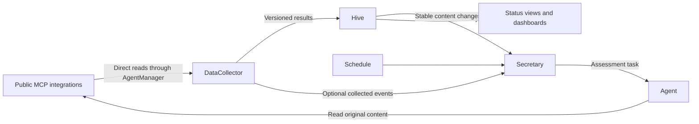

# MCP automation examples

These recipes combine public Outlook, Teams and Gmail MCP integrations with
DataCollector, Hive and Secretary. Account identities, service nodes and object
IDs are placeholders; templates start disabled.

| Pattern                                                 | Example                                                                       |
| ------------------------------------------------------- | ----------------------------------------------------------------------------- |
| Poll connected MCP tools without starting a model turn  | [Microsoft 365 and Gmail collector](data-collector/m365/README.md)            |
| Prepare a daily inbox briefing                          | [Scheduled Secretary assignment](secretary/README.md#daily-inbox-briefing)    |
| Group content changes and require fresh unread evidence | [Object-change assignment](secretary/README.md#grouped-unread-activity)       |
| React to a transition emitted by a custom MCP collector | [Collected-event assignment](secretary/README.md#collector-transition-events) |

## Adapt the pipeline

1. Connect the public MCP integrations on the native owner used by AgentManager.
   Discover its available tools and schemas. The collector's `mcp` binding selects
   that owner, an absolute project directory, a server and an explicit list of
   read tools. Plugin authentication stays with the native owner.
2. Copy the [collector task](data-collector/m365/m365.task.json), set neutral
   placeholders to your local configuration and follow its
   [setup and manual verification](data-collector/m365/README.md). Obtain the
   result object's actual Hive ID before configuring a watcher.
3. Copy a [Secretary assignment](secretary/README.md), select its account keys and
   result object, and verify that Secretary's execution target can use the same
   public MCP integrations. Enable the collector and assignment after verification.

The collector publishes a snapshot for all consumers. Stable message identities
and content revisions belong in `data.activity`; freshness and coverage belong in
`data.observation`. Watching stable paths lets regular polling refresh evidence
without launching an assessment for every timestamp change. Secretary applies
the user's contact rules after assessing the original content.

Separate tasks retain their own state and result objects. Separate collector
instances also need distinct result roots. Expected profile IDs guard against a
wrong connected account; selecting additional accounts depends on the MCP
runtime's account-binding capabilities.

An agent can discover sending or reply tools from the original public MCP
integration. Define permitted actions, recipients and limits in an assignment
before granting that work; the supplied examples only read source accounts.

The [DataCollector guide](../../services/data-collector/README.md) and
[Secretary requirements](../../specs/SECRETARY.md) describe the runtime contracts.
